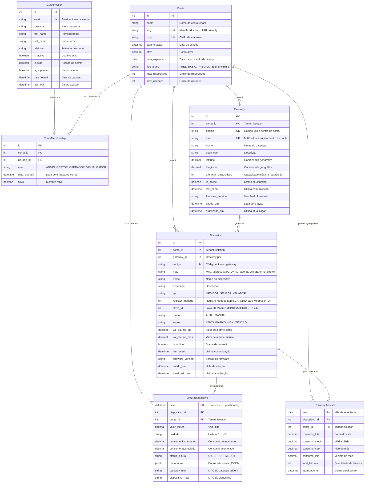

# Diagrama ER - Sistema TDS New

## Visão Geral
Este documento apresenta o diagrama Entidade-Relacionamento (ER) completo do sistema TDS New, uma plataforma SaaS multi-tenant para telemetria e gestão de dispositivos IoT.

---

## Diagrama ER Completo



---

## Descrição das Entidades

### 1. **CustomUser** (Camada de Autenticação)
- Modelo customizado do Django para autenticação
- Email como identificador único
- Suporta múltiplas contas via `ContaMembership`
- Campos de auditoria: `date_joined`, `last_login`

### 2. **Conta** (Tenant Multi-Tenant)
- Representa uma empresa/organização no sistema
- Isolamento de dados via `SaaSBaseModel`
- Controle de licença e limites (dispositivos, usuários)
- Tipos de plano: FREE, BASIC, PREMIUM, ENTERPRISE

### 3. **ContaMembership** (Vínculo Usuário-Conta)
- Relacionamento N:N entre `CustomUser` e `Conta`
- Roles hierárquicos: ADMIN > GESTOR > OPERADOR > VISUALIZADOR
- Controle de acesso granular por permissões

### 4. **Gateway** (Hub IoT)
- Concentrador de dispositivos IoT (ex: Raspberry Pi, ESP32)
- **Identificação MQTT**: `mac` usado como `client_id` do broker MQTT
- **Identificação única**: `codigo` + `mac` (unique per conta)
- Capacidade configurável (padrão: 8 dispositivos)
- Tracking de conectividade: `is_online`, `last_seen`, `firmware_version`
- Geolocalização: `latitude`, `longitude`
- **Papel MQTT**: Publica telemetria no tópico `tds/{conta_id}/{gateway_mac}/telemetry`

### 5. **Dispositivo** (Device IoT)
- Sensor/Medidor conectado ao Gateway via Modbus RS485
- **Arquitetura**: Gateway lê Modbus RTU e publica via MQTT (dispositivos não conectam direto)
- Suporte a Modbus RTU: `register_modbus`, `slave_id` (OBRIGATÓRIOS)
- Estados: ATIVO, INATIVO, MANUTENCAO
- Modos de operação: AUTO (leitura automática), MANUAL
- Alarmes configuráveis: diário e mensal
- **MAC address**: OPCIONAL (apenas para dispositivos WiFi/Ethernet que publicam diretamente no MQTT)

### 6. **LeituraDispositivo** (Telemetria - TimescaleDB)
- Hypertable do TimescaleDB particionada por `time`
- Armazena todas as leituras brutas dos dispositivos
- `metadados` JSONB para flexibilidade (temperatura, umidade, etc.)
- Campos de rastreabilidade: `gateway_mac`, `dispositivo_mac`
- Isolamento multi-tenant via `conta_id`

### 7. **ConsumoMensal** (View Materializada)
- Agregação mensal de consumo por dispositivo
- Contínuas agregações (Continuous Aggregates) do TimescaleDB
- Estatísticas: total, média, máximo, mínimo
- Atualização automática via TimescaleDB policies

---

## Relacionamentos e Cardinalidades

| Relação | Cardinalidade | Descrição |
|---------|---------------|-----------|
| CustomUser → ContaMembership | 1:N | Um usuário pode pertencer a várias contas |
| Conta → ContaMembership | 1:N | Uma conta possui vários membros |
| Conta → Gateway | 1:N | Uma conta possui vários gateways |
| Conta → Dispositivo | 1:N | Uma conta possui vários dispositivos |
| Gateway → Dispositivo | 1:N | Um gateway gerencia vários dispositivos (máx 8 configurável) |
| Dispositivo → LeituraDispositivo | 1:N | Um dispositivo gera múltiplas leituras ao longo do tempo |
| Dispositivo → ConsumoMensal | 1:N | Um dispositivo tem múltiplos registros mensais |

---

## Constraints e Índices

### Unique Constraints
```python
# Gateway
# - MAC obrigatório para identificação MQTT e rastreabilidade de hardware
unique_together = [('conta', 'codigo'), ('conta', 'mac')]

# Dispositivo
# - Codigo único dentro do gateway (ex: MED-001, MED-002, ...)
# - MAC opcional (apenas para dispositivos WiFi/Ethernet diretos)
# - Se MAC informado, deve ser único dentro da conta
unique_together = [('gateway', 'codigo')]
# Validação adicional no clean(): se mac não for None, deve ser único em conta

# ConsumoMensal
unique_together = [('mes', 'dispositivo')]
```

### Índices de Performance
```sql
-- TimescaleDB Hypertable (LeituraDispositivo)
CREATE INDEX idx_leitura_dispositivo_id ON leitura_dispositivo(dispositivo_id, time DESC);
CREATE INDEX idx_leitura_conta_id ON leitura_dispositivo(conta_id, time DESC);
CREATE INDEX idx_leitura_status ON leitura_dispositivo(status_leitura, time DESC);

-- PostgreSQL Indexes (Dispositivo)
CREATE INDEX idx_dispositivo_status ON dispositivo(status);
CREATE INDEX idx_dispositivo_online ON dispositivo(is_online);
CREATE INDEX idx_dispositivo_gateway ON dispositivo(gateway_id);

-- PostgreSQL Indexes (Gateway)
CREATE INDEX idx_gateway_conta ON gateway(conta_id);
CREATE INDEX idx_gateway_online ON gateway(is_online);
```

### Foreign Keys
- Todas as FKs com `on_delete=CASCADE` (exceto `Conta` e `CustomUser`)
- `Conta` e `CustomUser` usam `on_delete=PROTECT` para evitar exclusões acidentais

---

## Arquitetura MQTT e Identificação de Dispositivos

### Topologia da Rede IoT

```
┌─────────────────────────────────────────────────────────────┐
│                      Servidor MQTT Broker                    │
│                    (Eclipse Mosquitto)                       │
└─────────────────────────────────────────────────────────────┘
                              ▲
                              │ WiFi/Ethernet
                              │ Topic: tds/{conta_id}/{gateway_mac}/telemetry
                              │
┌─────────────────────────────────────────────────────────────┐
│                  Gateway (Raspberry Pi / ESP32)              │
│  - MAC: aa:bb:cc:dd:ee:ff (OBRIGATÓRIO)                     │
│  - MQTT Client ID: {conta_id}-{gateway_mac}                 │
│  - Publica telemetria agregada de todos os dispositivos     │
└─────────────────────────────────────────────────────────────┘
                              ▲
                              │ Modbus RS485
                              │ (2 fios: A/B)
                              │
        ┌─────────────────────┼─────────────────────┐
        │                     │                     │
┌───────────────┐     ┌───────────────┐     ┌───────────────┐
│ Dispositivo 1 │     │ Dispositivo 2 │     │ Dispositivo N │
│ Slave ID: 1   │     │ Slave ID: 2   │     │ Slave ID: N   │
│ Register: 100 │     │ Register: 200 │     │ Register: 300 │
│ MAC: N/A      │     │ MAC: N/A      │     │ MAC: N/A      │
└───────────────┘     └───────────────┘     └───────────────┘
  (Modbus RTU)          (Modbus RTU)          (Modbus RTU)
```

### Decisões de Design

#### 1. **Gateway.mac - OBRIGATÓRIO**
- **Propósito**: Identificação única do hardware do Gateway
- **Uso MQTT**: 
  - `client_id` do broker: `{conta_id}-{gateway_mac}`
  - Prefixo do tópico: `tds/{conta_id}/{gateway_mac}/telemetry`
- **Validação**: Regex `^([0-9A-Fa-f]{2}:){5}[0-9A-Fa-f]{2}$`
- **Unique**: `unique_together = [('conta', 'mac')]` - Gateway não pode ser duplicado na mesma conta
- **Rastreabilidade**: Campo `gateway_mac` em `LeituraDispositivo` identifica origem da telemetria

#### 2. **Dispositivo.mac - OPCIONAL**
- **Cenário A (Modbus RTU - 95% dos casos)**:
  - Dispositivos conectam via RS485 ao Gateway
  - Identificação por `slave_id` (1-247) + `register_modbus` (1-65535)
  - **MAC NÃO É NECESSÁRIO** (Modbus não usa MAC address)
  - Gateway interroga dispositivos via polling e agrega telemetria
  
- **Cenário B (WiFi/Ethernet direto - 5% dos casos)**:
  - Dispositivo conecta diretamente ao MQTT (ESP32, NodeMCU)
  - Publica no tópico: `tds/{conta_id}/{dispositivo_mac}/telemetry`
  - **MAC É OBRIGATÓRIO** para este tipo de dispositivo
  - Campo `mac` deve ser preenchido (`blank=True, null=True` no model)

- **Decisão**: 
  - Campo `mac` é **OPCIONAL** (suporta ambas arquiteturas)
  - Validação condicional no `clean()`: 
    - Se `tipo == 'MODBUS'`: `slave_id` obrigatório, `mac` opcional
    - Se `tipo == 'WIFI'`: `mac` obrigatório, `slave_id` opcional

#### 3. **Payload MQTT Esperado**

```json
{
  "gateway_mac": "aa:bb:cc:dd:ee:ff",
  "timestamp": "2026-02-15T14:30:00Z",
  "conta_id": 1,
  "dispositivos": [
    {
      "codigo": "MED-001",
      "slave_id": 1,
      "register_modbus": 100,
      "valor_leitura": 150.75,
      "unidade": "kWh",
      "consumo_instantaneo": 5.2,
      "consumo_acumulado": 1250.00,
      "status_leitura": "OK"
    },
    {
      "codigo": "MED-002",
      "slave_id": 2,
      "register_modbus": 200,
      "valor_leitura": 230.50,
      "unidade": "m3",
      "consumo_instantaneo": 12.8,
      "consumo_acumulado": 8940.00,
      "status_leitura": "OK"
    }
  ]
}
```

#### 4. **Fluxo de Dados MQTT → Django**

1. **Gateway** (Raspberry Pi):
   - Lê dispositivos Modbus a cada 10 segundos
   - Agrega leituras em um único payload JSON
   - Publica no MQTT: `tds/{conta_id}/{gateway_mac}/telemetry`

2. **Celery Task** (Week 8-9):
   - Subscrito no tópico `tds/+/+/telemetry`
   - Deserializa JSON do payload
   - Cria registros `LeituraDispositivo` no TimescaleDB
   - Atualiza `last_seen` do Gateway e Dispositivos

3. **TimescaleDB**:
   - Armazena leituras em hypertable particionada por `time`
   - Continuous Aggregate atualiza `ConsumoMensal` a cada 1 hora

---

## Multi-Tenant Isolation

### SaaSBaseModel
Todos os modelos de negócio herdam de `SaaSBaseModel`:
```python
class SaaSBaseModel(models.Model):
    conta = models.ForeignKey(Conta, on_delete=models.PROTECT)
    criado_em = models.DateTimeField(auto_now_add=True)
    atualizado_em = models.DateTimeField(auto_now=True)
    
    class Meta:
        abstract = True
```

### TenantMiddleware
- Injeta `conta_id` automaticamente em todas as queries
- Garante isolamento de dados entre tenants
- Previne acesso cruzado entre contas

---

## Integrações TimescaleDB

### Criação do Hypertable
```sql
-- Converter LeituraDispositivo em hypertable
SELECT create_hypertable('leitura_dispositivo', 'time', chunk_time_interval => INTERVAL '1 day');

-- Política de retenção (90 dias)
SELECT add_retention_policy('leitura_dispositivo', INTERVAL '90 days');

-- Continuous Aggregate para ConsumoMensal
CREATE MATERIALIZED VIEW consumo_mensal
WITH (timescaledb.continuous) AS
SELECT 
    time_bucket('1 month', time) AS mes,
    dispositivo_id,
    conta_id,
    SUM(valor_leitura) AS consumo_total,
    AVG(valor_leitura) AS consumo_medio,
    MAX(valor_leitura) AS consumo_max,
    MIN(valor_leitura) AS consumo_min,
    COUNT(*) AS total_leituras
FROM leitura_dispositivo
GROUP BY mes, dispositivo_id, conta_id;

-- Política de refresh automático
SELECT add_continuous_aggregate_policy('consumo_mensal',
    start_offset => INTERVAL '1 month',
    end_offset => INTERVAL '1 hour',
    schedule_interval => INTERVAL '1 hour');
```

---

## Comparação: TDS Original vs TDS New

| Aspecto | TDS Original | TDS New |
|---------|-------------|---------|
| **Multi-Tenant** | ❌ Não suportado | ✅ SaaSBaseModel + TenantMiddleware |
| **Gateway MAC** | ❌ Não implementado | ✅ Obrigatório (MQTT client_id + rastreabilidade) |
| **Dispositivo MAC** | ❌ Não implementado | ✅ Opcional (suporta Modbus RTU e WiFi/Ethernet) |
| **Identificação Dispositivo** | Apenas `codigo` | `codigo` + `slave_id` (Modbus) ou `mac` (WiFi) |
| **Protocolo Comunicação** | ❓ Não documentado | ✅ MQTT + Modbus RTU (arquitetura híbrida) |
| **Conectividade** | ❌ Não rastreada | ✅ `is_online`, `last_seen`, `firmware_version` |
| **Hierarquia** | Device → Coletor (FK única) | Dispositivo → Gateway (1:N com limite) |
| **TimescaleDB** | Hypertable não gerenciada | Hypertable gerenciada + Continuous Aggregates |
| **Alarmes** | Apenas valores estáticos | Valores + status de leitura |
| **Auditoria** | ❌ Não implementada | ✅ `criado_em`, `atualizado_em` em todos os modelos |
| **Geolocalização** | Apenas no Coletor | Gateway + possibilidade de estender para Dispositivo |
| **Payload MQTT** | ❓ Não documentado | ✅ JSON estruturado com array de dispositivos |

---

## Melhorias Implementadas

1. **Multi-Tenant Nativo**: Isolamento total de dados via `conta_id`
2. **Gateway MAC Obrigatório**: Identificação única para MQTT client_id e rastreabilidade
3. **Dispositivo MAC Opcional**: Suporta Modbus RTU (sem MAC) e WiFi/Ethernet (com MAC)
4. **Conectividade Tracking**: Status em tempo real de gateways/dispositivos
5. **Firmware Management**: Versionamento de firmware para atualizações OTA
6. **Constraints Robustas**: `unique_together` para evitar duplicações
7. **TimescaleDB Managed**: Hypertables gerenciadas pelo Django ORM
8. **Continuous Aggregates**: Agregações mensais automáticas
9. **Auditoria Completa**: Timestamps de criação/atualização
10. **Flexibilidade**: Campo `metadados` JSONB para extensibilidade
11. **Performance**: Índices otimizados para queries típicas
12. **Arquitetura MQTT**: Gateway agrega Modbus e publica via MQTT (reduz tráfego de rede)

---

## Próximos Passos (Week 6-7)

1. ✅ **Planejamento**: Diagrama ER completo com arquitetura MQTT
2. 🔄 **Implementação**:
   - Criar `tds_new/models/dispositivos.py` (Gateway + Dispositivo)
     - Gateway: `mac` obrigatório (CharField com regex validator)
     - Dispositivo: `mac` opcional (blank=True, null=True)
     - Validação condicional no `clean()` baseado no tipo de dispositivo
   - Criar `tds_new/models/telemetria.py` (LeituraDispositivo + ConsumoMensal)
   - Configurar TimescaleDB hypertable
   - Criar migrations e aplicar
3. 🔜 **Views e Templates**: CRUD para Gateway e Dispositivo
4. 🔜 **Integração MQTT**: Recepção de telemetria em tempo real (Week 8-9)
   - Celery worker para processar payloads MQTT
   - Paho-MQTT client subscrito em `tds/+/+/telemetry`
   - Validação de `gateway_mac` contra registros existentes
5. 🔜 **Dashboard**: Visualizações de consumo e status

---

## Validações Django (Modelo)

### Gateway.clean()
```python
def clean(self):
    super().clean()
    # Validar formato MAC: aa:bb:cc:dd:ee:ff
    if not re.match(r'^([0-9A-Fa-f]{2}:){5}[0-9A-Fa-f]{2}$', self.mac):
        raise ValidationError({'mac': 'Formato inválido. Use aa:bb:cc:dd:ee:ff'})
    
    # Validar unicidade do MAC dentro da conta (caso não esteja em unique_together)
    if Gateway.objects.filter(conta=self.conta, mac=self.mac).exclude(pk=self.pk).exists():
        raise ValidationError({'mac': f'Gateway com MAC {self.mac} já existe nesta conta'})
```

### Dispositivo.clean()
```python
def clean(self):
    super().clean()
    
    # Validação condicional baseada no tipo
    if self.tipo == 'MODBUS':
        # Modbus RTU: slave_id é obrigatório
        if not self.slave_id:
            raise ValidationError({'slave_id': 'Slave ID é obrigatório para dispositivos Modbus'})
        if not (1 <= self.slave_id <= 247):
            raise ValidationError({'slave_id': 'Slave ID deve estar entre 1 e 247'})
        if not self.register_modbus:
            raise ValidationError({'register_modbus': 'Registro Modbus é obrigatório'})
        if not (1 <= self.register_modbus <= 65535):
            raise ValidationError({'register_modbus': 'Registro deve estar entre 1 e 65535'})
    
    elif self.tipo in ['WIFI', 'ETHERNET']:
        # WiFi/Ethernet: MAC é obrigatório
        if not self.mac:
            raise ValidationError({'mac': 'MAC address é obrigatório para dispositivos WiFi/Ethernet'})
        if not re.match(r'^([0-9A-Fa-f]{2}:){5}[0-9A-Fa-f]{2}$', self.mac):
            raise ValidationError({'mac': 'Formato inválido. Use aa:bb:cc:dd:ee:ff'})
        
        # Validar unicidade do MAC dentro da conta
        if Dispositivo.objects.filter(conta=self.conta, mac=self.mac).exclude(pk=self.pk).exists():
            raise ValidationError({'mac': f'Dispositivo com MAC {self.mac} já existe nesta conta'})
    
    # Validar capacidade do gateway
    if self.gateway_id:
        dispositivos_no_gateway = Dispositivo.objects.filter(gateway=self.gateway, status='ATIVO').count()
        if dispositivos_no_gateway >= self.gateway.qte_max_dispositivos:
            raise ValidationError({
                'gateway': f'Gateway {self.gateway.codigo} atingiu capacidade máxima '
                           f'({self.gateway.qte_max_dispositivos} dispositivos)'
            })
```

---

**Última atualização**: 15/02/2026  
**Versão do Documento**: 1.1  
**Autor**: Sistema TDS New - Week 6-7 Planning + MQTT Architecture

   - Criar `tds_new/models/dispositivos.py` (Gateway + Dispositivo)
   - Criar `tds_new/models/telemetria.py` (LeituraDispositivo + ConsumoMensal)
   - Configurar TimescaleDB hypertable
   - Criar migrations e aplicar
3. 🔜 **Views e Templates**: CRUD para Gateway e Dispositivo
4. 🔜 **Integração MQTT**: Recepção de telemetria em tempo real (Week 8-9)
5. 🔜 **Dashboard**: Visualizações de consumo e status

---

**Última atualização**: 15/02/2026  
**Versão do Documento**: 1.0  
**Autor**: Sistema TDS New - Week 6-7 Planning
